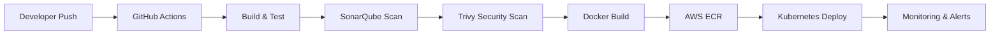

<div align="center">


<br/>


</div>

---

# 🌌 About Me

```yaml
name: Omkar Bhete
role: DevOps • Automation • DevSecOps Engineer

specialization:
  - Cloud Infrastructure
  - Infrastructure Automation
  - Kubernetes & Docker
  - CI/CD Pipelines
  - Monitoring & Logging
  - DevSecOps Security

currently_learning:
  - Advanced Kubernetes
  - Cloud-Native Architectures
  - Security Automation
  - Infrastructure Scaling

motto:
  "Automate • Secure • Scale ⚡"
```

---

# ⚡ Tech Stack & Tools

<div align="center">

## ☁️ Cloud Platforms


<br/><br/>

## 🚀 DevOps & Automation


<br/><br/>

## 🔐 DevSecOps & Monitoring


<br/><br/>

## 💻 Development & Databases


<br/><br/>

## 🛠️ Tools & Platforms


</div>

---

# 🚀 Featured Projects

<div align="center">

<table>
<tr>
<td width="50%">

## 🤖 AI Snap Attendance System

AI-powered smart attendance system using face recognition and voice verification with real-time analytics.

### ⚡ Tech Used
Python • OpenCV • AI • Flask • MongoDB

</td>

<td width="50%">

## 🚗 Smart Parking Platform

Cloud-native parking management platform with live tracking, booking, and AWS deployment.

### ⚡ Tech Used
React • Node.js • Docker • Kubernetes • AWS

</td>
</tr>

<tr>
<td width="50%">

## 🔐 DevSecOps CI/CD Pipeline

Secure CI/CD pipeline with automated vulnerability scanning and cloud deployments.

### ⚡ Tech Used
GitHub Actions • Jenkins • SonarQube • Trivy • Docker

</td>

<td width="50%">

## ☁️ Infrastructure Automation

Terraform-based infrastructure provisioning with reusable modules and AWS architecture.

### ⚡ Tech Used
Terraform • AWS • VPC • EC2 • IAM

</td>
</tr>

<tr>
<td width="50%">

## 🌌 Parikrama 2K26

Futuristic national-level event management platform with immersive UI/UX.

### ⚡ Tech Used
React • Express • MongoDB • Cloudinary • Docker

</td>

<td width="50%">

## 🎓 Admission Management System

Modern digital admission workflow system with real-time status tracking.

### ⚡ Tech Used
React • Node.js • MongoDB • Cloudinary

</td>
</tr>
</table>

</div>

---

# 🔥 DevSecOps Workflow

<div align="center">



</div>

---

# ⚙️ Infrastructure Philosophy

<div align="center">

```python
while(system_running):
    automate()
    secure()
    monitor()
    optimize()
    scale()
```

</div>

---

# 📊 GitHub Analytics

<div align="center">


</div>

---

# 🔥 Contribution Activity

<div align="center">


</div>

---

# ⚙️ System Status

<div align="center">

```diff
+ AWS Infrastructure Operational
+ Kubernetes Cluster Running
+ CI/CD Pipelines Active
+ Monitoring & Logging Enabled
+ DevSecOps Security Integrated
+ Infrastructure Automation Healthy
```

</div>

---

# 🌐 Connect With Me

<div align="center">

<a href="https://github.com/omkarbhete">
  
</a>

<a href="https://linkedin.com/in/YOUR_LINKEDIN">
  
</a>

<a href="mailto:YOUR_EMAIL@gmail.com">
  
</a>

</div>

---

# 🧠 Engineering Mindset

<div align="center">

```bash
> automate infrastructure
> secure deployments
> optimize systems
> scale applications
> never stop learning
```

</div>

---

<div align="center">


</div>

---

<div align="center">


</div>
