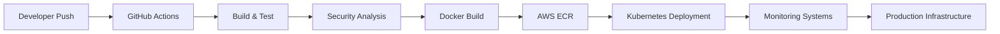

<div align="center">


<br/>


<br/><br/>


<br/><br/>


</div>

---

<div align="center">

```diff
+ Cloud Infrastructure Connected
+ Kubernetes Cluster Running
+ CI/CD Pipelines Operational
+ Monitoring Systems Enabled
+ DevSecOps Security Verified
+ Automation Engines Active
```

</div>

---

<div align="center">


</div>

---

# 🌌 NEURAL SYSTEM BOOT

<div align="center">

```bash
██████╗ ███████╗██╗   ██╗ ██████╗ ██████╗ ███████╗
██╔══██╗██╔════╝██║   ██║██╔═══██╗██╔══██╗██╔════╝
██║  ██║█████╗  ██║   ██║██║   ██║██████╔╝███████╗
██║  ██║██╔══╝  ╚██╗ ██╔╝██║   ██║██╔═══╝ ╚════██║
██████╔╝███████╗ ╚████╔╝ ╚██████╔╝██║     ███████║
╚═════╝ ╚══════╝  ╚═══╝   ╚═════╝ ╚═╝     ╚══════╝
```

</div>

---

<div align="center">

```diff
+ Cloud Infrastructure Connected
+ Kubernetes Control Plane Active
+ CI/CD Pipelines Running
+ Monitoring Systems Enabled
+ DevSecOps Layers Verified
+ Automation Engines Operational
```

</div>

---

<table>
<tr>

<td width="27%">

# 🌌 SYSTEM PROFILE

<div align="center">


</div>

<br/>

```yaml
user: omkarbhete

role:
  - DevOps Engineer
  - Automation Engineer
  - DevSecOps Practitioner

status: ONLINE

specialization:
  - AWS Infrastructure
  - Kubernetes
  - Docker
  - Terraform
  - CI/CD
  - Monitoring
```

---

# ⚡ DIGITAL IDENTITY

```bash
> USERNAME: omkarbhete

> STATUS: ONLINE

> REGION: INDIA

> MODE: BUILDING FUTURE

> FOCUS: CLOUD AUTOMATION
```

---

# 🌐 NETWORK ACCESS

<div align="center">

<a href="https://github.com/omkarbhete">

</a>

<br/><br/>

<a href="https://linkedin.com/in/YOUR_LINKEDIN">

</a>

<br/><br/>

<a href="mailto:YOUR_EMAIL@gmail.com">

</a>

</div>

---

# ⚡ CORE PRINCIPLES

```bash
Automate Everything

Secure Everything

Scale Limitlessly
```

---

# 🌌 ACTIVE MISSIONS

```diff
+ Building Cloud-Native Systems
+ Exploring DevSecOps
+ Automating Infrastructure
+ Learning Advanced Kubernetes
```

---

# ⚡ CURRENT STATUS

<div align="center">


</div>

</td>

<td width="73%">

# ⚡ OMKAR SYSTEM

### CLOUD • DEVOPS • AUTOMATION • DEVSECOPS

> “I don’t deploy applications.  
> I engineer intelligent cloud ecosystems.”

---

# 📊 LIVE SYSTEM ANALYTICS

<div align="center">


</div>

---

<div align="center">


</div>

---

# ☁️ TECHNOLOGY MATRIX

<div align="center">

### CLOUD & CONTAINERIZATION


<br/><br/>

### DEVOPS & AUTOMATION


<br/><br/>

### DEVSECOPS & MONITORING


<br/><br/>

### DEVELOPMENT STACK


</div>

---

# 🚀 FEATURED SYSTEMS

| SYSTEM | STATUS | DESCRIPTION |
|---|---|---|
| 🤖 AI Snap Attendance | ONLINE | AI-powered smart attendance ecosystem |
| 🚗 Smart Parking Platform | DEPLOYED | Cloud-native parking infrastructure |
| 🔐 DevSecOps Pipeline | SECURED | Enterprise-grade CI/CD workflows |
| ☁️ Infrastructure Automation | ACTIVE | Terraform-powered AWS provisioning |
| 🌌 Parikrama 2K26 | LIVE | Futuristic national-level platform |

---

<div align="center">


</div>

---

# 🔥 CLOUD INFRASTRUCTURE FLOW



---

# 🌌 REAL-TIME TERMINAL

```bash
$ ssh omkar@cloud-system

Access granted...

Loading infrastructure...

Connecting Kubernetes clusters...

Initializing monitoring systems...

Deployment pipelines active...

Cloud systems operational...

AI monitoring online...

SYSTEM STATUS: FULLY OPERATIONAL ⚡
```

---

# ⚡ SYSTEM HEALTH

```diff
+ AWS Infrastructure: OPERATIONAL
+ Kubernetes Cluster: HEALTHY
+ CI/CD Pipelines: ACTIVE
+ Monitoring Systems: ENABLED
+ Security Layers: VERIFIED
+ Automation Engines: RUNNING
+ Cloud Scaling: OPTIMIZED
```

---

# 🧠 AUTOMATION PHILOSOPHY

```python
while(system_running):

    automate()

    secure()

    monitor()

    optimize()

    scale()

    evolve()
```

---

# 🐍 CONTRIBUTION MATRIX

<div align="center">


</div>

---

# 🌌 SYSTEM ACTIVITY

<div align="center">


</div>

</td>

</tr>
</table>

---

<div align="center">


</div>
