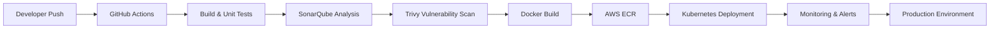

<div align="center">


<br/>


</div>

---

# 🌌 SYSTEM OVERVIEW

<div align="center">

```yaml
name: Omkar Bhete

role:
  - DevOps Engineer
  - Automation Engineer
  - DevSecOps Enthusiast

specialization:
  - Cloud Infrastructure
  - Infrastructure Automation
  - Kubernetes Orchestration
  - CI/CD Engineering
  - Monitoring & Observability
  - Security Automation

philosophy:
  "Automate everything. Secure everything. Scale endlessly."

status:
  system: ONLINE
  pipelines: ACTIVE
  kubernetes_cluster: HEALTHY
```

</div>

---

# ⚡ TECH UNIVERSE

<div align="center">

## ☁️ CLOUD & INFRASTRUCTURE


<br/><br/>

## 🚀 DEVOPS & AUTOMATION


<br/><br/>

## 🔐 DEVSECOPS & MONITORING


<br/><br/>

## 💻 DEVELOPMENT


</div>

---

# 🚀 ENGINEERING JOURNEY

<div align="center">

<table>
<tr>
<td width="50%">

## 🤖 AI Snap Attendance

AI-powered smart attendance system using facial recognition, voice verification, and real-time analytics.

### ⚡ Stack
Python • OpenCV • AI • Flask • MongoDB

</td>

<td width="50%">

## 🚗 Smart Parking Platform

Cloud-native smart parking ecosystem with AWS deployment and Kubernetes scalability.

### ⚡ Stack
React • Node.js • Docker • Kubernetes • AWS

</td>
</tr>

<tr>
<td width="50%">

## 🔐 DevSecOps Pipeline

Enterprise-grade CI/CD pipeline with automated security scanning and deployment workflows.

### ⚡ Stack
GitHub Actions • Jenkins • Trivy • SonarQube • Docker

</td>

<td width="50%">

## ☁️ Infrastructure Automation

Terraform-powered AWS infrastructure provisioning with reusable modules and secure networking.

### ⚡ Stack
Terraform • AWS • IAM • EC2 • VPC

</td>
</tr>

<tr>
<td width="50%">

## 🌌 Parikrama 2K26

Immersive futuristic event platform engineered for national-level technical events.

### ⚡ Stack
React • Express • MongoDB • Docker • Cloudinary

</td>

<td width="50%">

## 🎓 Admission Management

Digital admission workflow system with automation and real-time student tracking.

### ⚡ Stack
React • Node.js • MongoDB • Cloudinary

</td>
</tr>
</table>

</div>

---

# 🔥 DEVSECOPS PIPELINE ARCHITECTURE

<div align="center">



</div>

---

# 🌌 SYSTEM ACTIVITY

<div align="center">


</div>

---

# 📊 SYSTEM ANALYTICS

<div align="center">


</div>

---

# ⚡ REAL-TIME SYSTEM STATUS

<div align="center">

```diff
+ AWS Infrastructure: OPERATIONAL
+ Kubernetes Cluster: RUNNING
+ DevSecOps Pipelines: ACTIVE
+ Monitoring & Logging: ENABLED
+ Automation Workflows: HEALTHY
+ Security Layers: VERIFIED
```

</div>

---

# 🧠 AUTOMATION PHILOSOPHY

<div align="center">

```python
while(system_running):

    automate()

    secure()

    monitor()

    optimize()

    scale()
```

</div>

---

# 🌐 CONNECT WITH ME

<div align="center">

<a href="https://github.com/omkarbhete">
  
</a>

<a href="https://linkedin.com/in/YOUR_LINKEDIN">
  
</a>

<a href="mailto:YOUR_EMAIL@gmail.com">
  
</a>

</div>

---

# 🏆 ACHIEVEMENTS

<div align="center">


</div>

---

# 🌌 TERMINAL

<div align="center">

```bash
> initializing cloud infrastructure...

> loading kubernetes clusters...

> securing CI/CD pipelines...

> enabling monitoring systems...

> scaling applications...

SYSTEM STATUS: ONLINE ⚡
```

</div>

---

<div align="center">


</div>
