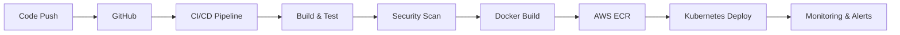

<div align="center">


<br/>


</div>

---

<table>
<tr>

<td width="28%">

# 🌌 SYSTEM PROFILE

<div align="center">


</div>

<br/>

```yaml
user: omkarbhete

role:
  - DevOps Engineer
  - Automation Engineer
  - DevSecOps Practitioner

status: ONLINE

specialization:
  - Cloud Infrastructure
  - Kubernetes
  - Docker
  - Terraform
  - CI/CD
```

---

# ⚡ ABOUT ME

```bash
DevOps Engineer passionate about
automation, cloud infrastructure,
and building scalable systems.
```

---

# 🌐 SYSTEM IDENTITY

```bash
> USER: omkarbhete

> ROLE: DevOps Engineer

> EXPERIENCE: 3+ YEARS

> STATUS: ONLINE

> LOCATION: INDIA

> FREELANCE: AVAILABLE
```

---

# 🔗 CONNECT

<div align="center">

<a href="https://github.com/omkarbhete">

</a>

<br/><br/>

<a href="https://linkedin.com/in/YOUR_LINKEDIN">

</a>

<br/><br/>

<a href="mailto:YOUR_EMAIL@gmail.com">

</a>

</div>

---

# 🧠 SYSTEM QUOTE

```bash
Automate Everything.
Secure Everything.
Scale Limitlessly.
```

</td>

<td width="72%">

# ⚡ OMKAR BHETE

### DEVOPS • AUTOMATION • DEVSECOPS ENGINEER

> “I don't just deploy applications.  
> I build systems that never sleep.”

---

# 📊 LIVE METRICS

<div align="center">

| REPOSITORIES | TOTAL STARS | FOLLOWERS | TOTAL COMMITS |
|---|---|---|---|
| 19 | 147 | 31 | 3.82K |

</div>

---

# ☁️ TECHNOLOGY STACK

<div align="center">

### CLOUD & INFRASTRUCTURE


<br/><br/>

### DEVOPS & AUTOMATION


<br/><br/>

### DEVSECOPS & MONITORING


<br/><br/>

### DEVELOPMENT STACK


</div>

---

# 🚀 FEATURED PROJECTS

| PROJECT | DESCRIPTION |
|---|---|
| 🤖 AI Snap Attendance | AI-powered smart attendance system using face recognition |
| 🚗 Smart Parking Platform | Cloud-native parking infrastructure with AWS deployment |
| 🔐 DevSecOps Pipeline | Enterprise-grade CI/CD workflows with security scanning |
| ☁️ Infrastructure Automation | Terraform-powered AWS provisioning |
| 🌌 Parikrama 2K26 | Futuristic national-level event platform |

---

# 🔥 DEVSECOPS PIPELINE ARCHITECTURE



---

# 📈 LIVE ANALYTICS

<div align="center">


</div>

---

# ⚡ SYSTEM HEALTH

```diff
+ AWS Infrastructure: OPERATIONAL
+ Kubernetes Cluster: HEALTHY
+ CI/CD Pipelines: ACTIVE
+ Monitoring Systems: ENABLED
+ Security Layers: VERIFIED
+ Automation Workflows: RUNNING
```

---

# 🌌 SYSTEM TERMINAL

```bash
$ kubectl get pods

NAME                     READY   STATUS    RESTARTS   AGE

devsecops-pipeline       1/1     Running   0          2d

monitoring-stack         1/1     Running   0          5d

automation-engine        1/1     Running   0          10d

web-application          1/1     Running   0          12d


$ system status

[✓] ALL SYSTEMS OPERATIONAL
```

---

# 📊 CURRENT ACTIVITY

```bash
> Deployed new microservice to production

> Optimized CI/CD pipeline execution

> Automated vulnerability scanning

> Scaling Kubernetes cluster nodes

> Monitoring dashboards online
```

</td>

</tr>
</table>

---

<div align="center">

# ⚡ BUILDING THE FUTURE, AUTOMATING THE PRESENT ⚡


<br/><br/>


</div>
