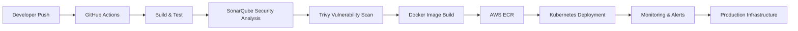

<div align="center">


<br/>


</div>

---

# 🌌 SYSTEM INITIALIZATION

<div align="center">

```bash
> booting OMKAR_SYSTEM...

> loading cloud infrastructure...

> connecting kubernetes clusters...

> initializing CI/CD pipelines...

> enabling DevSecOps layers...

SYSTEM STATUS: ONLINE ⚡
```

</div>

---

# 🧠 CORE PROFILE

<div align="center">

```yaml
name: Omkar Bhete

role:
  - DevOps Engineer
  - Automation Engineer
  - DevSecOps Enthusiast

specialization:
  - Cloud Infrastructure
  - Kubernetes Orchestration
  - Infrastructure Automation
  - Secure CI/CD Pipelines
  - Monitoring & Observability

mission:
  "Designing scalable, secure, and automated systems."

status:
  infrastructure: HEALTHY
  automation: ACTIVE
  pipelines: RUNNING
```

</div>

---

# ⚡ TECH ECOSYSTEM

<div align="center">

## ☁️ CLOUD & CONTAINERIZATION


<br/><br/>

## 🚀 DEVOPS & AUTOMATION


<br/><br/>

## 🔐 DEVSECOPS & MONITORING


<br/><br/>

## 💻 DEVELOPMENT STACK


</div>

---

# 🚀 ENGINEERING JOURNEY

<div align="center">

<table>
<tr>
<td width="50%">

# 🤖 AI Snap Attendance

AI-powered smart attendance ecosystem using face recognition and voice verification.

### ⚡ Stack
Python • OpenCV • Flask • MongoDB

</td>

<td width="50%">

# 🚗 Smart Parking Platform

Cloud-native parking infrastructure with AWS deployment and Kubernetes scalability.

### ⚡ Stack
React • Node.js • Docker • Kubernetes • AWS

</td>
</tr>

<tr>
<td width="50%">

# 🔐 DevSecOps Pipeline

Enterprise-grade CI/CD pipeline with automated security scanning and deployments.

### ⚡ Stack
GitHub Actions • Jenkins • Trivy • SonarQube • Docker

</td>

<td width="50%">

# ☁️ Infrastructure Automation

Terraform-powered AWS infrastructure provisioning with reusable IaC modules.

### ⚡ Stack
Terraform • AWS • IAM • EC2 • VPC

</td>
</tr>

<tr>
<td width="50%">

# 🌌 Parikrama 2K26

Immersive futuristic national-level event management platform.

### ⚡ Stack
React • Express • MongoDB • Docker

</td>

<td width="50%">

# 🎓 Admission Management

Real-time digital admission workflow system with automation and analytics.

### ⚡ Stack
React • Node.js • MongoDB • Cloudinary

</td>
</tr>
</table>

</div>

---

# 🔥 DEVSECOPS ARCHITECTURE

<div align="center">



</div>

---

# 🌌 REAL-TIME ANALYTICS

<div align="center">


</div>

---

# ⚙️ SYSTEM HEALTH

<div align="center">

```diff
+ AWS Infrastructure: OPERATIONAL
+ Kubernetes Cluster: ACTIVE
+ CI/CD Pipelines: RUNNING
+ Monitoring Systems: HEALTHY
+ DevSecOps Security: VERIFIED
+ Automation Services: ENABLED
```

</div>

---

# ⚡ AUTOMATION PHILOSOPHY

<div align="center">

```python
while(system_running):

    automate()

    secure()

    monitor()

    optimize()

    scale()
```

</div>

---

# 🌐 CONNECT

<div align="center">

<a href="https://github.com/omkarbhete">
  
</a>

<a href="https://linkedin.com/in/YOUR_LINKEDIN">
  
</a>

<a href="mailto:YOUR_EMAIL@gmail.com">
  
</a>

</div>

---

# 🏆 ACHIEVEMENTS

<div align="center">


</div>

---

# 🌌 TERMINAL ACCESS

<div align="center">

```bash
$ ssh omkar@cloud-system

Access granted...

Loading infrastructure...

Kubernetes clusters connected...

Monitoring dashboards online...

Deployment pipelines active...

Welcome to the future ⚡
```

</div>

---

<div align="center">


</div>
