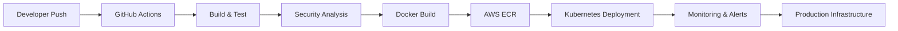

<div align="center">


<br/>


</div>

---

# 🌌 SYSTEM BOOT

<div align="center">

```bash
> booting OMKAR_SYSTEM...

> loading cloud infrastructure...

> initializing kubernetes clusters...

> securing deployment pipelines...

> enabling automation engines...

SYSTEM STATUS: OPERATIONAL ⚡
```

</div>

---

# 🧠 DIGITAL PROFILE

<div align="center">

```yaml
name: Omkar Bhete

role:
  - DevOps Engineer
  - Automation Engineer
  - DevSecOps Enthusiast

specialization:
  - Cloud Infrastructure
  - Kubernetes Orchestration
  - Infrastructure Automation
  - Secure CI/CD Pipelines
  - Monitoring & Observability

focus:
  - AWS Architecture
  - Infrastructure as Code
  - DevSecOps Security
  - Automation Workflows
  - Cloud-Native Systems

philosophy:
  "Automate everything. Secure everything. Scale endlessly."
```

</div>

---

# ⚡ CLOUD ECOSYSTEM

<div align="center">

## ☁️ CLOUD & CONTAINERIZATION


<br/><br/>

## 🚀 DEVOPS & AUTOMATION


<br/><br/>

## 🔐 DEVSECOPS & MONITORING


<br/><br/>

## 💻 DEVELOPMENT


</div>

---

# 🌌 INFRASTRUCTURE MAP

<div align="center">



</div>

---

# 🚀 ENGINEERING JOURNEY

<div align="center">

<table>
<tr>
<td width="50%">

# 🤖 AI Snap Attendance

AI-powered attendance ecosystem using face recognition and intelligent analytics.

### ⚡ Stack
Python • OpenCV • Flask • MongoDB

</td>

<td width="50%">

# 🚗 Smart Parking Platform

Cloud-native parking infrastructure engineered with Kubernetes scalability.

### ⚡ Stack
React • Node.js • Docker • Kubernetes • AWS

</td>
</tr>

<tr>
<td width="50%">

# 🔐 DevSecOps Pipeline

Enterprise-grade CI/CD workflows with automated vulnerability scanning.

### ⚡ Stack
GitHub Actions • Jenkins • Trivy • SonarQube • Docker

</td>

<td width="50%">

# ☁️ Infrastructure Automation

Terraform-powered AWS infrastructure provisioning with reusable modules.

### ⚡ Stack
Terraform • AWS • IAM • EC2 • VPC

</td>
</tr>

<tr>
<td width="50%">

# 🌌 Parikrama 2K26

Immersive futuristic national-level event management platform.

### ⚡ Stack
React • Express • MongoDB • Docker

</td>

<td width="50%">

# 🎓 Admission Management

Real-time digital admission workflow system with automation.

### ⚡ Stack
React • Node.js • MongoDB • Cloudinary

</td>
</tr>
</table>

</div>

---

# 📊 LIVE SYSTEM ANALYTICS

<div align="center">


</div>

---

# ⚡ SYSTEM HEALTH

<div align="center">

```diff
+ AWS Infrastructure: ACTIVE
+ Kubernetes Cluster: HEALTHY
+ DevSecOps Pipelines: RUNNING
+ Monitoring Systems: ENABLED
+ Infrastructure Automation: OPERATIONAL
+ Security Layers: VERIFIED
```

</div>

---

# 🌌 REAL-TIME TERMINAL

<div align="center">

```bash
$ ssh omkar@cloud-system

Access granted...

Loading infrastructure...

Connecting Kubernetes clusters...

Initializing monitoring dashboards...

CI/CD pipelines online...

Cloud systems operational...

Welcome to the future ⚡
```

</div>

---

# 🧠 AUTOMATION PHILOSOPHY

<div align="center">

```python
while(system_running):

    automate()

    secure()

    monitor()

    optimize()

    scale()
```

</div>

---

# 🌐 CONNECT

<div align="center">

<a href="https://github.com/omkarbhete">
  
</a>

<a href="https://linkedin.com/in/YOUR_LINKEDIN">
  
</a>

<a href="mailto:YOUR_EMAIL@gmail.com">
  
</a>

</div>

---

<div align="center">


</div>

---

<div align="center">


</div>
