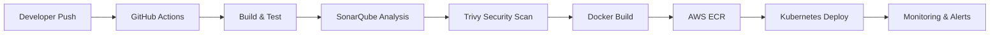

<div align="center">


<br/>


</div>

---

# 🌌 About Me

```yaml
name: Omkar Bhete
role: DevOps • Automation • DevSecOps Engineer

focus:
  - Infrastructure Automation
  - CI/CD Pipelines
  - DevSecOps Security
  - Kubernetes & Docker
  - Cloud Infrastructure

currently_learning:
  - Advanced Kubernetes
  - Security Automation
  - Infrastructure Scaling
  - Cloud-Native Architectures

motto:
  "Automate • Secure • Scale ⚡"
```

---

# ⚡ Tech Universe

<div align="center">

## ☁️ Cloud & DevOps


<br/><br/>

## 🔐 DevSecOps & Automation


<br/><br/>

## 💻 Development


</div>

---

# 🚀 Engineering Journey

<div align="center">

| ⚡ System | 🚀 Description |
|---|---|
| 🔐 DevSecOps Pipeline | Secure CI/CD workflow with Trivy & SonarQube integration |
| ☁️ Infrastructure Automation | Terraform-based AWS infrastructure provisioning |
| 🚗 Smart Parking Platform | Cloud-native scalable parking management system |
| 🤖 AI Snap Attendance | AI-powered smart attendance platform |
| 🌌 Parikrama 2K26 | Futuristic national-level event platform |

</div>

---

# 🔥 Automation + DevSecOps Pipeline

<div align="center">



</div>

---

# ⚙️ Automation Philosophy

<div align="center">

```python
while(system_running):
    automate()
    secure()
    monitor()
    optimize()
    scale()
```

</div>

---

# 📊 GitHub Analytics

<div align="center">


</div>

---

# 🔥 Contribution Activity

<div align="center">


</div>

---

# ⚙️ System Status

<div align="center">

```diff
+ Infrastructure Automation Active
+ DevSecOps Pipelines Running
+ Kubernetes Cluster Operational
+ Monitoring & Logging Enabled
+ CI/CD Systems Healthy
```

</div>

---

# 🌐 Connect With Me

<div align="center">

<a href="https://github.com/omkarbhete">
  
</a>

<a href="https://linkedin.com/in/YOUR_LINKEDIN">
  
</a>

<a href="mailto:YOUR_EMAIL@gmail.com">
  
</a>

</div>

---

<div align="center">


</div>

---

<div align="center">


</div>
