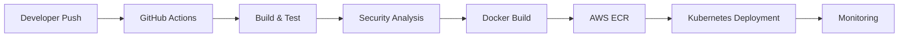

<div align="center">


<br/>


</div>

---

<table>
<tr>

<td width="28%">

# 🌌 SYSTEM PROFILE

<div align="center">


</div>

<br/>

```yaml
user: omkarbhete

role:
  - DevOps Engineer
  - Automation Engineer
  - DevSecOps Enthusiast

status: ONLINE

experience:
  - AWS Infrastructure
  - Kubernetes
  - Docker
  - CI/CD
  - Terraform
```

---

# ⚡ SYSTEM IDENTITY

```bash
> USER: omkarbhete

> ROLE: DevOps Engineer

> STATUS: ONLINE

> LOCATION: INDIA

> MODE: BUILDING FUTURE
```

---

# 🌐 CONNECT

<div align="center">

<a href="https://github.com/omkarbhete">

</a>

<br/><br/>

<a href="https://linkedin.com/in/YOUR_LINKEDIN">

</a>

<br/><br/>

<a href="mailto:YOUR_EMAIL@gmail.com">

</a>

</div>

---

# 🧠 SYSTEM QUOTE

```bash
Automate Everything.
Secure Everything.
Scale Limitlessly.
```

</td>

<td width="72%">

# ⚡ OMKAR BHETE

### DEVOPS • AUTOMATION • DEVSECOPS ENGINEER

> “I don't just deploy applications.  
> I build scalable systems that never sleep.”

---

# ☁️ TECHNOLOGY STACK

<div align="center">

### CLOUD & INFRASTRUCTURE


<br/><br/>

### DEVOPS & AUTOMATION


<br/><br/>

### DEVSECOPS & MONITORING


<br/><br/>

### DEVELOPMENT


</div>

---

# 🚀 FEATURED PROJECTS

| PROJECT | DESCRIPTION |
|---|---|
| 🤖 AI Snap Attendance | AI-powered smart attendance system using face recognition |
| 🚗 Smart Parking Platform | Cloud-native parking infrastructure with AWS & Kubernetes |
| 🔐 DevSecOps Pipeline | Enterprise-grade CI/CD with vulnerability scanning |
| ☁️ Infrastructure Automation | Terraform-powered AWS provisioning |
| 🌌 Parikrama 2K26 | Futuristic national-level event platform |

---

# 🔥 DEVSECOPS PIPELINE



---

# 📊 LIVE ANALYTICS

<div align="center">


</div>

---

# ⚡ SYSTEM HEALTH

```diff
+ AWS Infrastructure: ACTIVE
+ Kubernetes Cluster: HEALTHY
+ CI/CD Pipelines: RUNNING
+ Monitoring Systems: ENABLED
+ Automation Services: ONLINE
+ Security Layers: VERIFIED
```

---

# 🌌 SYSTEM TERMINAL

```bash
$ ssh omkar@cloud-system

Access granted...

Loading infrastructure...

Connecting Kubernetes clusters...

Initializing monitoring systems...

Deployment pipelines active...

SYSTEM STATUS: OPERATIONAL ⚡
```

</td>

</tr>
</table>

---

<div align="center">

# ⚡ BUILDING THE FUTURE, AUTOMATING THE PRESENT ⚡


</div>
